# Codebase Atlas — Architecture (Phase 2: focus+context + blast-radius)

**Pattern:** Extends the MVP hexagonal modular monolith (`docs/design/ARCHITECTURE.md`). Core
stays pure and renderer-agnostic; `BlastRadiusClient` is a new Input adapter (sole MCP
touchpoint); `GraphCanvas` remains the sole Output adapter (ADR-001 unchanged — no second
renderer). P2 adds three Core modules (`FocusPolicy`, `combineGradients`,
`reverseDepsFromGraph`), one Input adapter (`BlastRadiusClient`), and extends `ViewState` +
`GraphCanvas`. Nothing in MVP Core is replaced; all is extended.

## Component decomposition (incremental — P2 additions emphasized)

```mermaid
flowchart TB
  subgraph Adapters_In[Input adapters]
    GFR[GraphifyRunner]
    LOADER[GraphJsonLoader]
    BLAST[BlastRadiusClient — MCP get_pr_impact + timeout + fallback]:::newP2
  end
  subgraph Core[Core — pure, renderer-agnostic]
    MODEL[TypedGraphModel]
    TYPER[NodeTyper]
    SELECT[SelectionState — focus, matchScores, focusScores, blastRadius, focusId, selection]
    CULL[ViewportPolicy — mount cap + LOD]
    FOCUS[FocusPolicy — BFS distance over mountedIds to focusScores]:::newP2
    COMBINE[combineGradients — variadic, max floor, otimes reduce]:::newP2
    REV[reverseDepsFromGraph — fallback reverse-edge BFS + id normalization]:::newP2
  end
  subgraph Adapters_Out[Output adapters]
    CANVAS[GraphCanvas — opacity + blast ring/edge]
    PANE[DetailPane]
    SEARCH[SearchBar — match scores]
  end
  GFR --> LOADER --> MODEL
  TYPER --> MODEL
  MODEL --> CULL
  SELECT --> CULL
  CULL --> CANVAS
  MODEL --> PANE
  SEARCH --> SELECT
  CANVAS --> SELECT
  SELECT --> FOCUS
  FOCUS --> COMBINE
  SEARCH --> COMBINE
  COMBINE --> CANVAS
  SELECT --> BLAST
  BLAST --> REV
  BLAST --> CANVAS
  classDef newP2 fill:#1E293B,stroke:#22C55E,stroke-width:2px;
```



**Load-bearing boundary (unchanged from MVP):** Core imports nothing from React Flow and
nothing from the graphify MCP. `BlastRadiusClient` is the sole MCP touchpoint (adapter);
`reverseDepsFromGraph` (the fallback) is pure Core. Swapping MCP for another blast-radius
source leaves Core untouched.

## Data model (P2 extensions — extend, do not replace)

```typescript
// MVP types unchanged: AtlasNode, AtlasEdge, TypedGraphModel, NodeRole.

interface ViewState {
  focusId: string | null;                 // MVP — first seed for MVP compat (contract §9: F14)
  focusSeedIds: Set<string>;              // P2 US-010: cluster focus (singleton set for US-008)
  matchScores: Map<string, number>;       // MVP — search, 0..1
  focusScores: Map<string, number>;       // P2 NEW — BFS distance over mountedIds, 0..1
  combinedOpacity: Map<string, number>;   // P2 NEW — combineGradients(...scores) → floor 0.18
  mountedIds: Set<string>;                // MVP — ViewportPolicy output (SCALE-001 unchanged)
  blastRadius: BlastRadius | null;        // P2 NEW — reverse-deps from selection
  selection: { kind: 'node' | 'cluster'; id: string | number } | null;
                                         // P2 NEW — discriminator for P4's RepresentationContent
                                         // (contract §18). `kind: 'node'` for single-click select;
                                         // `kind: 'cluster'` for shift-click multi-select (US-010).
                                         // For cluster, `id` is the community of the first seed
                                         // (cluster identity semantics — see §'Cluster identity
                                         // semantics' below + SRS-P2 open item).
}

interface BlastRadius {
  focusNodeId: string;
  impactedIds: string[];                  // upstream dependents (reverse-deps)
  impactEdges: AtlasEdge[];               // reverse-dep edges to emphasize
  source: 'mcp' | 'graph-fallback';       // provenance — shown in UI (AVAIL-002)
}

// FocusPolicy signature (contract §10):
//   computeFocusScores(
//     model: TypedGraphModel,
//     seedIds: Set<string>,
//     mountedIds: Set<string>,            // BFS restricted to this subset
//     opts?: { maxDist?: number }
//   ): Map<string, number>
//
// combineGradients signature (contract §11):
//   combineGradients(
//     ...scores: Map<string, number>[],
//     floor?: number                       // default 0.18
//   ): Map<string, number>
//   reducing via max(floor, product)
```

Design decisions embedded:
- `focusScores` is the SAME shape as `matchScores` (`Map<id, 0..1>`) — the "ONE mechanism"
  property (SPEC §4). One combine function, one opacity slot.
- `combinedOpacity` is what `GraphCanvas` reads for opacity. When `focusId` is null,
  `focusScores` is all-1 ⇒ `combinedOpacity === matchScores` ⇒ MVP behavior preserved.
- `focusSeedIds` generalizes `focusId` to a set (US-010). `focusId` retained for MVP compat
  (`focusId = [...focusSeedIds][0]` when singleton; `null` when empty).
- `FocusPolicy.computeFocusScores` takes `mountedIds: Set<string>` explicitly (contract §10) —
  BFS traverses only edges where BOTH endpoints are in `mountedIds`. This is what locks
  PERF-004's bound (Task 1 test: 1000-node model + 10-node `mountedIds` → BFS touches ≤
  mounted edge count).
- `combineGradients` is variadic (contract §11): reducing via `max(floor, product)` so P3/P4
  can add further gradient inputs without changing the combiner. Backward-compatible: P2
  still calls it as `combineGradients(matchScores, focusScores)`.
- `BlastRadius.source` makes provenance honest (AVAIL-002) — the UI shows which path produced it.
- Combine rule: **multiply** with floor 0.18 (contract §8). Rationale: a node must be relevant
  on BOTH axes (match AND near-focus) to stay fully bright; either axis can dim it. When one
  axis is inactive (all-1), the other alone decides — backward-compatible with MVP.

### Cluster identity semantics (for `selection.kind === 'cluster'`)

P4's `RepresentationContent` (P4 plan §7 line 621) reads `selection: { kind: 'cluster' | 'node';
id: number | string }` — the `id` is the cluster's stable identity. To make this contract
honest, P2 defines the mapping from a shift-click seed set to a cluster id as follows:

- **Identity source:** the `community` field of the **first seed** in the seed set (Set
  iteration order — JS insertion order). The contract is: shift-clicking within a single
  community produces a cluster id equal to that community.
- **Cross-community shift-click is NOT supported in P2.** If a developer shift-clicks nodes
  across multiple communities, `selection.kind` is still `'cluster'` and the id is the first
  seed's community — but the BFS-distance union (§'Critical flows' D) is still computed over
  the full seed set (the gradient doesn't care; only the identity does). This is documented as
  an open item in SRS-P2 §6 — the P2 gesture assumes single-community multi-select; a future
  phase may relax this (e.g. by defining a synthetic cluster id for cross-community selections).
- **P4 must read `selection.id` as a community number when `kind === 'cluster'`.** P2's
  `selectCluster(seedIds)` derives the id from `model.nodes.find(n => n.id === firstSeed).community`.

This closes the P2↔P4 interface gap (contract §18): P2 produces
`{ kind: 'cluster', id: <community> }`; P4 consumes it without redefining what a "cluster" is.

## Node typing (unchanged)

P2 adds no node roles. `NodeTyper` is reused as-is. Blast-radius and focus are graph-distance
concepts, independent of role.

## Critical flows (mirror MVP A/B/C)

**D — focus → gradient (US-008, PERF-004, SCALE-001) — TWO PHASE (contract §7).**
*Phase 1 — CLICK / mount recompute.* Developer clicks a node → `SelectionState.select(id)`
→ `ViewportPolicy` recomputes the mount set around the new focus (MVP flow C, ≤ cap). New
nodes may enter the mounted set. **Sets `view.selection = { kind: 'node', id }`** (contract
§18; P4 consumer key).
*Phase 2 — FOCUS GRADIENT recompute (style-only).* `FocusPolicy.computeFocusScores(model,
focusSeedIds, mountedIds)` BFS distance **restricted to the mounted subset** (contract §10) →
`focusScores` (0..1, floor 0.18) → `combineGradients(matchScores, focusScores)` →
`combinedOpacity` → `GraphCanvas` updates node **style.opacity only**. NO remount. The mount
set is NOT expanded by the gradient phase — Phase 1 already settled it. Failure: no focus
→ `focusScores` all-1 → MVP behavior. "Focus on an unmounted node" is well-defined: Phase 1
re-centers the mount set on the click (≤ cap), Phase 2 applies the gradient to the
re-centered set.

**E — select → blast-radius (US-009, AVAIL-002, contract §9).** Developer selects a node
(same `select(id)` action as flow D) → `BlastRadiusClient.fetchBlastRadius(nodeId, { mcp?,
model })` → MCP `get_pr_impact` (primary) or `reverseDepsFromGraph` (fallback) →
`BlastRadius` → `GraphCanvas` renders edge stroke emphasis (`--accent`, thicker) on
`impactEdges` + node ring on `impactedIds` (a **stroke**, not opacity — USABILITY-002).
`DetailPane` shows `source` badge. Distinct channel from focus gradient (opacity), so they
compose. **Empty case:** when `impactedIds` is empty (leaf node, F7), no ring/edge is
rendered; `DetailPane` shows "No upstream dependents" and the source badge is still shown.

**F — MCP unavailable / timeout / malformed-response fallback (US-009, AVAIL-002, F5, F6,
F11).** `BlastRadiusClient` attempts MCP `get_pr_impact` wrapped in `Promise.race` with a
3s timeout (F5). On timeout, throw, OR a malformed response (no `impacted_ids` array — F6)
the client falls back to `reverseDepsFromGraph(model, nodeId)` (pure Core transitive
reverse-edge BFS). The result is normalized against `model.nodes`/`model.edges` (F11: any
ids returned by MCP that are not present in the model are filtered out). The fallback
yields `BlastRadius` with `source: 'graph-fallback'` → UI shows fallback provenance; no
crash, no missing blast-radius. The fallback is slightly less rich than MCP (no
change-diff awareness) but always available — the ADR-003 tradeoff.

**G — clearFocus (contract §9).** Developer clears focus → `SelectionState.clearFocus()`
resets `focusSeedIds` to empty, `focusScores` to all-1, `blastRadius` to `null` (the
select coupling is symmetric), AND `view.selection` to `null` (the P4 consumer key
is cleared in the same atomic update — contract §18). `combinedOpacity` collapses to
`matchScores` (MVP behavior preserved). No remount.

## C4

**No container boundary change.** MVP L2: local React app + graphify (external) + graph.json
(file interface). P2 uses a new **interface** to the existing graphify container: the graphify
MCP server (`get_pr_impact`). It is not a new container — it is a new port on graphify. The
atlas still has no backend, no DB. The fallback path uses `graph.json` directly (existing
interface), so MCP-unavailable does not change the container diagram.

## Decisions surfaced (ADRs)

- **ADR-003** (Accepted): Blast-radius source — graphify MCP `get_pr_impact` (primary) with
  direct `graph.json` reverse-edge traversal fallback. See `docs/adr/ADR-003-blast-radius-source.md`.
- **ADR-001** (Accepted, unchanged): React Flow sole output adapter. P2 extends `GraphCanvas`
  in place — no second renderer.
- **ADR-002** (Accepted, unchanged): shadcn/ui + Base UI primitives. P2 reuses for blast-radius
  provenance badge + ring styling.

## Flagged — NOT decided here

- **Cluster-focus gesture (US-010).** The mechanism (`focusSeedIds: Set`) is specced; the
  MVP-default gesture is **shift-click** multiple nodes → seed set (contract §12). Other
  gestures (right-click community, pane button) may be added later — the mechanism is the
  invariant. **Cluster identity semantics:** `selection.kind === 'cluster'` carries the
  community id of the first seed; cross-community shift-click is not supported in P2 (open
  item, see SRS-P2 §6).
- **`/modify` consumer wiring.** Atlas-side blast-radius is delivered; wiring the same MCP into
  sdlc-engineer `/modify` is an aede-side concern (SPEC §8, §9). NOT in atlas scope.
- **Focus + search visual collision (USABILITY-001).** Multiply-combine (AND) is the design
  (contract §8); a UX check during P2 polish confirms a strong-match-far-focus node at floor
  0.18 is still distinguishable from background. DESIGN-SYSTEM floor 0.18 is the hedge.
- **P3/P4 gradient extension point.** `combineGradients` is variadic (contract §11); P3
  (reasons) / P4 (representation) may add gradient inputs here. Keep it the one extension
  point.
- **Blast-radius pane placement (F15, open item).** Blast-radius renders as a `DetailPane`
  section in P2 as an **interim placement**. When P3 introduces the right-pane tab model
  (`PaneTabs` per `docs/CROSS-PHASE-CONTRACT.md` §2 — `behavior` / `structure` / `reasons` /
  `code` tabs), blast-radius moves into the `code` tab. Task 10's section is the rendering
  substrate; the tab wrapper is P3's job. This avoids the P3/P4 chrome-ownership war.

## Reused from MVP vs new (P2)

**Reused unchanged:** `GraphifyRunner`, `GraphJsonLoader`, `NodeTyper`, `TypedGraphModel`,
`ViewportPolicy`, `SearchBar`, `DetailPane`, `SelectionState` (extended, not replaced),
`matchScores` (MVP search scoring), React Flow + shadcn/Base UI stack (ADR-001/002), full
DESIGN-SYSTEM (Okabe-Ito roles, opacity scale, floor 0.18).

**New (P2):**
- Core: `FocusPolicy` (BFS distance over `mountedIds` → `focusScores`), `combineGradients`
  (variadic, the ONE mechanism combiner), `reverseDepsFromGraph` (fallback reverse-deps +
  id normalization against `model.nodes`/`model.edges`).
- Input adapter: `BlastRadiusClient` (MCP `get_pr_impact` with 3s timeout, response
  validation, id filtering, and fallback dispatch).
- Output adapter extension: `GraphCanvas` reads `combinedOpacity`; renders blast-radius ring +
  edge emphasis (non-opacity channel).
- Types: `ViewState` extended (`focusSeedIds`, `focusScores`, `combinedOpacity`,
  `blastRadius`, **`selection` discriminator** for P4 — contract §18); `BlastRadius` added.
- ADR: ADR-003 (blast-radius source).

## Excluded from P2

Reasons/tradeoff pane (P3), C4/sequence representation-switch (P4), onboarding tour (P5),
agent-injection consumer wiring (`/modify` — aede-side), multi-user / distributed concerns.
See `docs/SPEC.md` §8.
