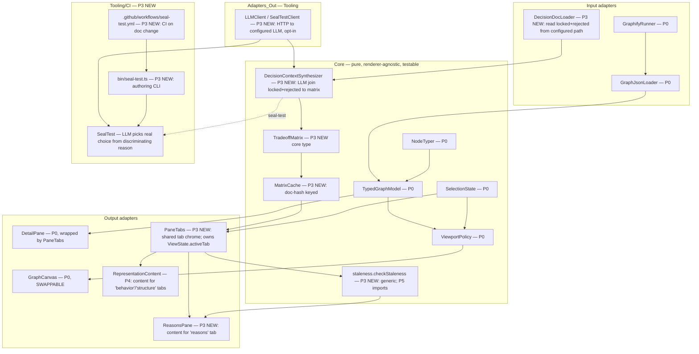

# Codebase Atlas — Architecture (Phase 3: Reasons Pane)

**Pattern:** extends the MVP hexagon (see ARCHITECTURE.md). New input adapter
`DecisionDocLoader`, new core `DecisionContextSynthesizer` + `TradeoffMatrix` + `MatrixCache`,
new output adapter `ReasonsPane` (a right-pane tab), new tooling `SealTest`. The core stays
renderer-agnostic and testable with Vitest; the LLM is an injected interface (the token-cost
boundary is ONE function). React Flow remains the sole graph renderer (ADR-001); ReasonsPane
is a pane tab, not a graph replacement.

## Component decomposition (extends MVP)



**Load-bearing boundaries (extend MVP's):**
- Core (incl. `Synthesizer`, `TradeoffMatrix`, `MatrixCache`, `staleness.checkStaleness`) imports nothing from React. `ReasonsPane` is the sole React touchpoint for matrices — mirrors the ADR-001 hedge.
- The LLM call lives behind an injected `LLMClient` / `SealTestClient` interface (concrete adapters in `src/adapters/llmClient.ts` + `src/adapters/sealTestClient.ts`; HTTP to configured endpoint, opt-in gate, API key from env/config, timeout, error handling). The token-cost boundary is ONE function (`Synthesizer.synthesize`); tests mock it; no Core import of an SDK.
- `DecisionDocLoader` is project-agnostic (MAINT-002); aede's path is one configured instance.
- `PaneTabs` is the SHARED right-pane tab container (P3 owns the chrome; P4's `RepresentationContent` registers `behavior`/`structure` tabs via `TabRegistration`).

## Data model (core types — P3 additions)

```typescript
interface TradeoffOption {
  name: string;
  discriminatingWhy: string;   // why this option IS or ISN'T chosen — the load-bearing cell
  metric: string;              // quantified where possible
  consequence: string;         // what follows if chosen
}
interface TradeoffMatrix {
  id: string;                  // STABLE SLUG derived from the decision title
                                // (canonical key for P5 TourStep.reasonRef; immutable across re-synthesis)
  decisionTitle: string;
  options: TradeoffOption[];   // rejected + the chosen, side by side (must be non-empty)
  chosenOption: string;        // name of the chosen option (must exist in options)
  bindNodeIds: string[];       // AtlasNode ids this decision explains (refs P0 model)
  bindCommunityIds: number[];  // cluster-level binding (optional)
}
interface SealTestResult {
  passed: boolean;
  confidence: number;          // 0..1 — fraction of runs that picked the real chosen option
  runs: number;                // default 5
  missingTradeoffHint?: string;
}
interface DecisionContextEntry {
  matrix: TradeoffMatrix;
  sourceDocHash: string;       // doc-hash cache key (COST-001)
  synthesizedAt: string;       // ISO date-stamp (FRESH-001)
  sealTestResult: SealTestResult;
}
// Class form (single source of truth — no parallel docHashByDecisionId map).
// get(id, hash) returns the entry ONLY when sourceDocHash === hash;
// put() refuses entries with sealTestResult.passed === false (QUAL-001 invariant).
// load() resets to empty cache on corrupt JSON (does NOT throw).
class MatrixCache {
  private byDecisionId: Map<string, DecisionContextEntry>;
  get(id: string, currentDocHash: string): DecisionContextEntry | undefined;
  put(entry: DecisionContextEntry): void;            // refuses incomplete entries
  load(filePath: string): void;                      // corrupt JSON -> empty + warn
  save(filePath: string): void;
}
// Injected — the token-cost boundary. Mock for tests; real impl in src/adapters/.
interface LLMClient {
  synthesize(input: { decisionTitle: string; locked: string; rejected: string }): Promise<TradeoffMatrix>;
}
interface SealTestClient {
  pickRealOption(matrixWithChosenHidden: TradeoffMatrix): Promise<string | null>;
  // null / throw => miss (handled gracefully — gate records the failure as incomplete)
}

// --- PaneTabs / TabId — P3 OWNS these. P4/P5 import from here. ---
type TabId = 'behavior' | 'structure' | 'reasons' | 'code';
interface TabRegistration {
  id: TabId;
  label: string;
  content: ReactNode;          // ReactNode; lives in the components layer
}
// Props on <PaneTabs>: tabs: TabRegistration[]; activeTab: TabId; onTabChange(id: TabId)
// P3 registers the 'reasons' tab (content = <ReasonsPane />).
// P4's RepresentationContent registers 'behavior' and 'structure' via the same API.

// --- ViewState.activeTab — P3 OWNS the field. P5's TourController SETS it. ---
// P3 introduces activeTab: TabId on the existing ViewState (P0). P5's TourController
// sets it via the existing mechanism (the same way P3's ReasonsPaneController reads it).
// P5 does NOT redefine activeTab; it imports TabId from PaneTabs and writes the same field.
interface ViewState { activeTab: TabId; focusId: string | null; /* ...MVP fields */ }

// --- staleness.checkStaleness — generic, P3 OWNS. P5 imports. ---
type Stamped = { hash: string; date: string };        // ISO date
type StalenessInput = { currentHash: string; ageDaysWindow: number };
type StalenessResult = { kind: 'fresh' | 'hash-mismatch' | 'age-stale'; message: string };
function checkStaleness(stamped: Stamped, input: StalenessInput): StalenessResult;
// P3 calls: checkStaleness({hash: sourceDocHash, date: synthesizedAt}, {currentHash, ageDaysWindow})
// P5 calls: checkStaleness({hash: graphHash, date: dateStamp}, {currentHash: currentGraphHash, ageDaysWindow})
// P3 keeps a thin stalenessOf wrapper for its own call sites (backward compat).
```

**Design decisions embedded:**
- `TradeoffMatrix` is a NEW core type; it REFERENCES `AtlasNode` ids / `community` ids from
  the P0 model — it does NOT duplicate node data (no drift).
- `TradeoffMatrix.id` is a **stable slug derived from the decision title** (sluggified,
  deterministic) — P5 `TourStep.reasonRef` keys on it. Same decision doc ⇒ same `id` (Task 2 test locks this).
- `sourceDocHash` is the cache key → regeneration only on doc change (COST-001).
- `sealTestResult` is stored ON the entry — the gate is part of the artifact, not a separate
  runtime check (QUAL-001). Incomplete entries never reach the pane as "complete" — `MatrixCache.put` refuses them; `ReasonsPane` renders the "incomplete" state when `passed === false`.
- `synthesizedAt` drives staleness via the shared `checkStaleness` generic (FRESH-001).
- LLM egress isolated behind `LLMClient` / `SealTestClient` (SEC-002): only the configured
  endpoint receives decision-doc text. The adapter reads endpoint + API key + opt-in from
  config (no hardcoded URLs); synthesis is gated on `opt-in === true`.
- `PaneTabs` owns the right-pane tab chrome; `ViewState.activeTab: TabId` lives in P3. P4's
  `RepresentationContent` registers tabs via `TabRegistration`; P5's `TourController` SETS
  `activeTab` via the existing mechanism (does not redefine).
- `checkStaleness` is the cross-phase staleness function (FRESH-001 reused by P5).

## Critical flows

**A — docs to synthesize to cache to render (US-011, COST-001):** Maintainer to
`DecisionDocLoader` reads locked+rejected from the configured path to
`DecisionContextSynthesizer` calls `LLMClient.synthesize` (COSTS TOKENS, one-time per
decision) to `TradeoffMatrix` to `SealTest` (5 runs, QUAL-001) to if pass,
`DecisionContextEntry` (matrix + hash + date + seal result) to `MatrixCache` (persisted to
`.atlas/matrix-cache.json`, doc-hash keyed). Developer selects a node to
`SelectionState.focusId` to `ReasonsPaneController` looks up the cached entry by
`bindNodeIds` and renders the terse matrix. **Cache hit means zero LLM calls at render.**
On cache miss the controller triggers a synthesis; on synth failure the controller
renders a defined "synthesis failed" state (no crash, no partial matrix).

**B — doc-change to stale to regenerate (US-013, FRESH-001):** Maintainer edits a decision
doc to `DecisionDocLoader` re-reads to hash differs from `MatrixCache.byDecisionId[id].sourceDocHash`
to bound entries marked stale to `ReasonsPane` shows a staleness warning (via shared
`checkStaleness({hash: sourceDocHash, date: synthesizedAt}, {currentHash, ageDaysWindow})`)
to next refresh re-synthesizes ONLY the changed decision (unchanged docs stay cached).
Age staleness: `synthesizedAt` older than the review window (default 90 days) to warn even
without a hash change.

**C — authoring to seal-test to gate (US-012, QUAL-001):** Author/curator edits decision
docs to runs `bin/seal-test.ts` (the authoring CLI) to `SealTest` hides the chosen marker,
sends the entry-only to `SealTestClient.pickRealOption`, 5 independent runs, counts picks
of the real chosen option for the discriminating reason to confidence below 0.8 means
incomplete means warn + `missingTradeoffHint`. CI runs the same gate on doc change (via
`.github/workflows/seal-test.yml`) to blocks merge of incomplete entries. Incomplete
entries are NOT rendered as complete matrices in the pane (ReasonsPane shows the
"incomplete" state; MatrixCache.put refuses them at the cache boundary).

**D — malformed decision doc (US-014, AVAIL-001):** Loader detects no H2 headings / title
mismatch between locked and rejected / locked without rejected / rejected without locked
to reports the specific malformation with the searched file path to synthesis skipped for
that doc to reasons pane shows an empty state for affected nodes (no crash, no partial
matrix, no silent empty result).

**E — corrupt cache file (AVAIL-001):** `MatrixCache.load` on a corrupt `.atlas/matrix-cache.json`
resets to empty cache + logs warning to app continues with no matrices to synthesis re-runs
on next refresh (does NOT throw, does NOT crash).

## C4 (extends MVP L1/L2)

- **L1 Context:** Maintainer/Developer/Author to Codebase Atlas to depends on graphify
  (structure, P0) + the target repo's **decision docs (NEW input source)** + a
  **user-configured LLM endpoint (NEW — first token-costing integration)**.
- **L2 Container:** local React app + graphify + `graph.json` + decision-docs (files) +
  `MatrixCache` (local persisted file `.atlas/matrix-cache.json`) + LLM API (external,
  user-configured). No atlas-hosted backend; the LLM is the only egress (SEC-002).

## Decisions surfaced (ADRs)

- **ADR-004** (Accepted): configurable decision-doc path + per-decision LLM synthesis +
  doc-hash cache. See `docs/adr/`.
- **ADR-005** (Accepted): seal-test gate at authoring + CI, confidence >= 0.8 (4/5 runs).

## Flagged — NOT decided here

- **LLM model / provider** for synthesis + seal-test — user config (endpoint, API key,
  opt-in flag) loaded from a config file or env vars; default for the first build is an
  open item (SRS-P3 §9). The `LLMClient` interface makes this swappable.
- **Decision-doc convention for non-aede repos** — default search patterns cover common
  cases; project-specific parsers are an open item.
- **Agent-injection** via the host's `build_system_prompt` — out of atlas scope. The atlas
  exposes synthesized matrices as a consumable artifact (e.g. `.atlas/matrices.json`); the
  injection mechanism is host-side. P3 is a **single consumer (human reads the matrix in
  the right pane); agent-export is an open integration surface, not a P3 deliverable.**
- **Right-pane tab chrome** — RESOLVED: `PaneTabs` (P3 owns) wraps `DetailPane`. P3
  registers the `reasons` tab; P4's `RepresentationContent` registers `behavior`/`structure`
  via the `TabRegistration` API. The `code` tab content is future (P2 blast-radius section
  is the substrate).

## Token-cost boundary (COST-001 — load-bearing; first token-costing phase)

P3 is the FIRST phase that costs tokens (SPEC §8b). The boundary is explicit and narrow:
- `DecisionContextSynthesizer.synthesize` is the sole synthesis token cost — one call per
  decision per doc-hash. Cache hit means free render.
- `SealTest` costs 5 short calls per entry at authoring/CI time — bounded, never at render.
- All other P3 components (loader, cache, render, staleness, gate orchestration) are
  token-free.
- LLM egress is isolated behind `LLMClient` / `SealTestClient` (SEC-002): only the
  configured endpoint receives decision-doc text; no other egress; no telemetry.

## Reused from MVP (P0+P1)

- `TypedGraphModel` + `AtlasNode` ids + `community` ids — matrix binding references these.
- `SelectionState` (`focusId`) — drives which matrix the pane shows.
- `DetailPane` shell — UNCHANGED. P3 wraps it in `PaneTabs`; P4 adds more tabs into PaneTabs.
- DESIGN-SYSTEM (dark OLED, terse, tokens, Lucide) — ReasonsPane + PaneTabs follow it.
- Vitest + Testing Library; the Core to React boundary-guard pattern (MVP Task 9).

## New in P3

- `PaneTabs` (component, P3 owns) — shared right-pane tab container; exports
  `TabId` + `TabRegistration`. Wraps `DetailPane`. Owns `ViewState.activeTab`.
- `DecisionDocLoader` (input adapter) + decision-doc fixtures.
- `TradeoffMatrix` + `TradeoffOption` + `DecisionContextEntry` + `SealTestResult` (core types).
- `MatrixCache` (core class — `get/put/load/save`; refuses incomplete entries; corrupt-JSON
  tolerant).
- `DecisionContextSynthesizer` (core, LLM-backed via injected `LLMClient`).
- `assembleEntry` (core) — stamps ISO date, attaches hash + seal result, builds
  `DecisionContextEntry` (tested).
- `staleness.checkStaleness` (core, generic) — `Stamped` + `StalenessInput` + `StalenessResult`;
  `stalenessOf` is a thin wrapper for P3's own use. P5 imports `checkStaleness`.
- `SealTest` + gate (tooling/CI) — 5-run confidence; `pickRealOption` returning `null` /
  throwing / returning an unknown option are all handled as "miss" (graceful).
- `ReasonsPane` + `ReasonsPaneController` (output adapters — right-pane tab; controller
  handles the empty / synthesizing / synthesis-failed / cache-hit / staleness states).
- `LLMClient` / `SealTestClient` interfaces (injected; mock for tests) + concrete adapters
  in `src/adapters/llmClient.ts` + `src/adapters/sealTestClient.ts` (HTTP, config-driven,
  opt-in, timeout, error handling).
- `bin/seal-test.ts` — authoring CLI invoking `runSealTest` + `gateEntry` on decision docs.
- `.github/workflows/seal-test.yml` — CI on doc-change PRs.
- LLM config: config-file/env-driven endpoint, API key, `opt-in` flag. Synthesis gated on
  `opt-in === true`; refused silently otherwise (no crash, no LLM call, no egress).
- `MatrixCache` persistence (`.atlas/matrix-cache.json`).
- Refresh trigger — a "refresh" affordance in `ReasonsPaneController` (manual re-synth of
  the bound decision) and an integration point for graphify's `--watch` / hooks (out of
  P3's runtime; the controller listens for hash-change events).

## Excluded from P3

Agent-injection (`build_system_prompt` is a host-project concern, not an atlas deliverable),
P4 representation switch (C4/sequence — P4 owns), P5 onboarding tour. All recorded in
`docs/SPEC.md` §8.
