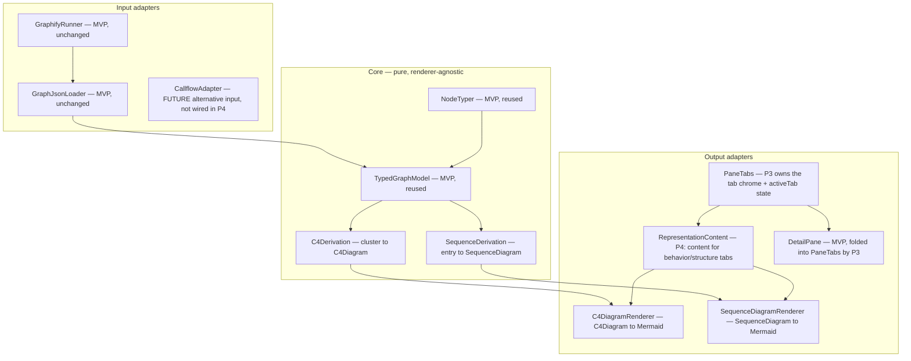
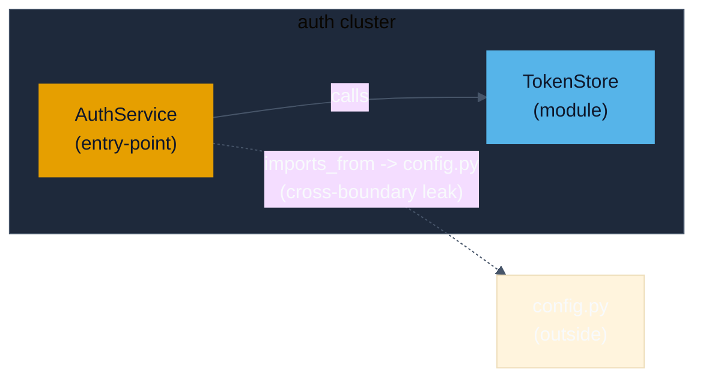
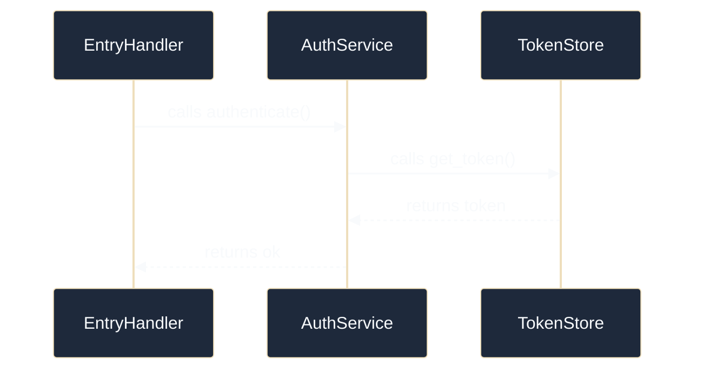

# Codebase Atlas — Architecture (Phase 4: Representation Switch)

**Pattern:** Extends the MVP hexagon (`docs/design/ARCHITECTURE.md`). New **Core** derivation
functions (`C4Derivation`, `SequenceDerivation`) are pure, renderer-agnostic, testable without
Mermaid. New **Output adapters** (`RepresentationContent`, `C4DiagramRenderer`,
`SequenceDiagramRenderer`) provide the behavior/structure tab CONTENT and render Mermaid in
the right pane. The right-pane tab CHROME itself (`PaneTabs` + `ViewState.activeTab` +
`type TabId`) is owned by P3 — P4 registers into it via the `TabRegistration` API. **graphify**
and **React Flow** are unchanged — React Flow stays the sole GRAPH renderer (ADR-001);
C4/sequence are a different representation in a different pane.

## Component decomposition (P4 additions highlighted)



**Load-bearing boundaries:**
- `C4Derivation` / `SequenceDerivation` import only `TypedGraphModel` types — never Mermaid,
  never React. Swapping Mermaid for another diagram format leaves Core untouched (ADR-006 hedge).
- `C4DiagramRenderer` / `SequenceDiagramRenderer` are the SOLE Mermaid touchpoints (mirror of
  ADR-001's "GraphCanvas is the sole React Flow touchpoint"). The Core/Mermaid boundary is
  enforced by an AST-based import check (see plan Task 9; ADR-006 hedge is locked by a
  parser-level test, not a substring scan).
- **Tab chrome is P3's** (`PaneTabs` + `TabId`); P4's `RepresentationContent` provides the
  behavior/structure tab CONTENT and registers into `PaneTabs` via `TabRegistration`:
  `tabs: [{id:'behavior', label, content: <BehaviorDiagram />}, {id:'structure', label, content: <StructureDiagram />}]`.
  P4 imports `type TabId` from P3's `src/components/PaneTabs.tsx` (does not redefine it).

## Data model (new Core types — derived from TypedGraphModel)

> US IDs in this section are the canonical IDs: US-015 (C4), US-016 (sequence), US-017
> (cross-boundary). Replaces the original P4 numbering (US-014/015/016) per
> `docs/CROSS-PHASE-CONTRACT.md` §1.

```typescript
// Reused from MVP (unchanged): AtlasNode, AtlasEdge, TypedGraphModel, NodeRole, community.

// C4 derivation output
interface C4Container {
  id: string;
  label: string;
  role: NodeRole;            // reuse — drives color via classDef
  nodeIds: string[];         // members (1..N; a container may wrap one node or a sub-cluster)
}
interface C4Boundary {
  id: string;
  label: string;             // cluster/subsystem name (community label or node label)
  containerIds: string[];    // containers inside the boundary
}
interface CrossBoundaryDep {
  from: string;              // container id INSIDE the boundary
  to: string;                // node id OUTSIDE the boundary (the leak)
  toLabel: string;           // human-readable target label — NAMES the leak
  relation: AtlasEdge['relation'];
  label: string;             // "calls X", "imports Y" — the §4 honesty label
}
interface C4Diagram {
  boundary: C4Boundary;
  containers: C4Container[];
  internalEdges: AtlasEdge[];            // edges wholly inside the boundary
  crossBoundaryDeps: CrossBoundaryDep[]; // THE honesty property — never hidden when present
}

// Sequence derivation output
interface SequenceStep {
  id: string;                // participant (node id)
  label: string;
  role: NodeRole;
}
interface SequenceMessage {
  from: string;
  to: string;
  label: string;             // relation / call name
  relation: AtlasEdge['relation'];
  order: number;             // PATH order — start to end, not a region
}
interface SequenceDiagram {
  entryId: string;           // start of the PATH
  steps: SequenceStep[];     // participants along the path
  messages: SequenceMessage[];  // ordered messages — a PATH, threads through overlap
  truncated: boolean;        // true if path-length cap applied (PERF-005 LOD)
}
```

Design decisions embedded:
- `crossBoundaryDeps` is a first-class field, never derived-on-demand — the honesty property
  is structural, not a render-time choice. A C4Diagram with cross-deps present MUST list them.
  LOD on the container count (PERF-005) does NOT truncate `crossBoundaryDeps` — the honesty
  list stays complete regardless of cap.
- `SequenceDiagram.truncated` makes the PERF-005 cap observable/testable.
- Both types are pure data — no Mermaid strings in Core.

## Critical flows

**A — select cluster → C4 derivation → Mermaid render (US-015, US-017):** Developer selects a
cluster (community) in GraphCanvas → DetailPane focus changes → `PaneTabs` (P3-owned
chrome) activates "structure" tab via `ViewState.activeTab` → `RepresentationContent`
(P4-owned content) renders the structure renderer → `C4Derivation(model, clusterId,
{ maxContainers })` returns `C4Diagram` (containers + crossBoundaryDeps) →
`C4DiagramRenderer(diagram)` emits Mermaid → pane renders. Cross-boundary deps rendered as
labeled external arrows (US-017). Honesty preserved under LOD: `crossBoundaryDeps` stays
complete even when containers are LOD-capped.

**B — select entry → sequence derivation → Mermaid render (US-016):** Developer selects an
entry-point node → `PaneTabs` activates "behavior" tab → `RepresentationContent` renders the
behavior renderer → `SequenceDerivation(model, entryId, { maxPath })` walks `calls`/`uses`
edges as an ordered PATH (with a visited-set, terminating when no unvisited successors
remain — handles cycles safely) → returns `SequenceDiagram` → `SequenceDiagramRenderer(diagram)`
emits Mermaid sequence → pane renders. Path threads through overlap (cross-cluster messages
stay in; no cluster cut out). A no-call entry renders an honest empty sequence with a
"no calls" Note.

**C — cross-boundary dep labeling (US-017, the honesty property):** `C4Derivation` partitions
edges by whether both endpoints are in the boundary. In-boundary edges → `internalEdges`;
out-of-boundary edges → `crossBoundaryDeps` with `toLabel` + `relation` + `label`. The renderer
MUST emit each cross-boundary dep as an external arrow. Test asserts: for a cluster with K
cross-boundary edges, the C4Diagram lists exactly K `CrossBoundaryDep` entries with non-empty
`label` — none hidden. A second render-side test mutates the diagram by removing one dep
and asserts the test fails (locks the honesty property end-to-end).

## C4

- **L1/L2 unchanged** from MVP (`docs/design/ARCHITECTURE.md`): local React app + graphify +
  graph.json. No new container. P4 adds **Mermaid render** as an output concern inside the
  existing React app container — not a new deployable.

## Mermaid theme (DESIGN-SYSTEM parity — USABILITY-003)

Mermaid `theme: base` + `themeVariables` maps DESIGN-SYSTEM tokens; role colors via `classDef`.

| DESIGN-SYSTEM token | Mermaid themeVariable / classDef |
|---|---|
| `--background` `#0F172A` | `background` |
| `--foreground` `#F8FAFC` | `primaryTextColor` |
| `--card` `#1E293B` | `clusterBkg`, `nodeBkg` |
| `--border` `#475569` | `lineColor`, `clusterBorder` |
| `--accent` `#22C55E` | cross-boundary arrow color (visually distinct) |
| role colors (Okabe-Ito) | `classDef roleEntry fill:#E69F00,...` per role |

Cross-boundary arrows use `--accent` + a dashed style; in-boundary edges use `--border` solid.
This makes the honesty property visible at a glance (US-017 §"Cross-boundary arrows are visually distinct from in-boundary edges").

## Example output (illustrative — what the right pane renders)

**C4 container (structure tab) — boundary + labeled external leak:**



**Sequence (behavior tab) — a PATH, threads through overlap:**



## Decisions surfaced (ADRs)

- **ADR-006** (Accepted): Mermaid as diagram format; C4/sequence derived from `graph.json` via
  pure Core functions; graphify callflow reuse deferred (HTML-only, not structured). See
  `docs/adr/ADR-006-diagram-format-and-derivation.md`.

## Flagged — NOT decided here

- **CallflowAdapter:** a future alternative INPUT (downgraded from "seam that enriches
  `SequenceDerivation`" per `docs/CROSS-PHASE-CONTRACT.md` §19). graphify v0.9.4 emits
  callflow as HTML only (SPEC §1); no structured data to consume. P4 re-derives sequence
  from `graph.json` call edges. If a future graphify version exposes callflow JSON,
  `CallflowAdapter` would REPLACE the `graph.json` derivation path entirely (it would
  become a new `SequenceDiagram` source), not enrich the existing `SequenceDerivation`.
  Tracked open in SRS-P4 §8.
- **Large-subsystem LOD thresholds:** container-cap (default `maxContainers = 50`) and
  path-length-cap (PERF-005) are tunable; calibrate against httpx + aede fixtures during
  `/implement`. Honesty preserved: LOD caps containers visually only — `crossBoundaryDeps`
  is never LOD-truncated.

## Reused from MVP (unchanged) vs new (P4)

**Reused:** `TypedGraphModel`, `AtlasNode`, `AtlasEdge`, `NodeRole`, `community`, `NodeTyper`,
`GraphifyRunner`, `GraphJsonLoader`, `GraphCanvas` (React Flow, left pane), `DetailPane` shell,
shadcn/ui, DESIGN-SYSTEM tokens, Vitest + Testing Library.

**Reused from P3 (cross-phase):** `PaneTabs` (right-pane tab chrome; P3-owned), `type TabId`
(imported from `src/components/PaneTabs.tsx`; P3-defined), `TabRegistration` (P3-defined
interface used to register the behavior/structure tabs).

**New (P4):** `C4Derivation` (Core), `SequenceDerivation` (Core), `C4Container`/`C4Boundary`/
`CrossBoundaryDep`/`C4Diagram` types (Core), `SequenceStep`/`SequenceMessage`/`SequenceDiagram`
types (Core), `RepresentationContent` (Output adapter — **a plain function returning
`TabRegistration[]`**, not a React component; called by P3's `PaneTabs` with `{model, selection}`
to produce the behavior/structure tab content), `C4DiagramRenderer` (Output adapter),
`SequenceDiagramRenderer` (Output adapter), `CallflowAdapter` (Input adapter, future
alternative input — not wired in P4 per contract §19), `mermaidTheme` shared module
(Output adapter), Mermaid dependency (render-only, in output adapters).
