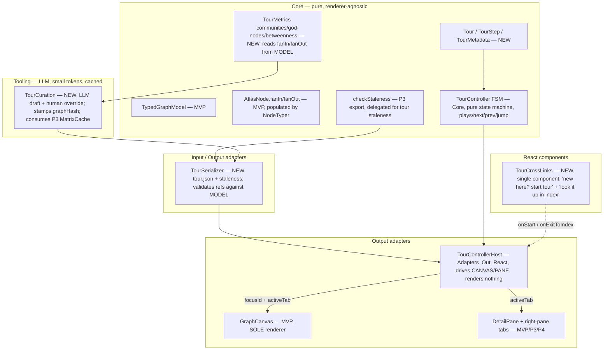

# Codebase Atlas — Architecture (P5: Onboarding Tour)

**Pattern:** Extends the MVP hexagon (ARCHITECTURE.md). P5 adds **core tour types**, **graph-
metrics extractors** (pure Core, **reuse `AtlasNode.fanIn`/`fanOut` populated by NodeTyper** —
F17), a **TourController FSM** (pure Core state machine) + a **TourControllerHost** (React
adapter) that DRIVES existing components (no second renderer — ADR-001 intact), a
**TourSerializer** I/O adapter (`tour.json` alongside `graph.json`), a **TourCuration**
tooling module (LLM, small tokens, cached), and a single **TourCrossLinks** React component
for both cross-link directions (F16 — THIN invariant). P5 is THIN: the controller issues
focus + active-tab commands to existing `GraphCanvas` / `DetailPane` / right-pane tabs; it
renders nothing of its own.

## Component decomposition (additions shaded)



**Load-bearing boundary:** `TourControllerHost` (Adapters_Out, React) imports nothing from
React Flow; the pure-Core `TourController FSM` imports nothing from React at all. The host
emits `focusId` + `activeTab` commands consumed by existing `GraphCanvas` / `DetailPane`
(same `SelectionState` MVC already built). Swapping the renderer (ADR-001) leaves the tour
intact. F18 — the split mirrors how P3 separates `PaneTabs` (chrome) from `ReasonsPane`
(content): the FSM is the testable, renderer-agnostic core; the host is the React
touchpoint.

## Data model (new core types — reference existing ids, do not redefine)

```typescript
// TabId is OWNED BY P3 — imported from src/components/PaneTabs.tsx (contract §3).
// P5 does NOT define a local tab enum. P4's RepresentationContent registers
// 'behavior' and 'structure' into the same TabId union; the host projects
// representationHint onto the registered tab set (fallback: 'reasons' on miss — F11).
import type { TabId } from '../components/PaneTabs';

// reasonRef is the P3 TradeoffMatrix.id (a stable slug derived from the decision title —
// ARCHITECTURE-P3 §'Data model'; contract §4). No P5-local id scheme.

interface TourStep {
  id: string;                       // stable within tour
  nodeId: string;                   // -> AtlasNode.id (P1) — REQUIRED
  // clusterId REMOVED (F12). Cluster-level tour steps are deferred until a phase
  // implements cluster-level focus steps. P2 US-010 is for the *focus* gradient only.
  reasonRef?: string;               // -> P3 TradeoffMatrix.id (stable slug, contract §4)
  narrative: string;                // terse — "compress words, never reasoning"
  representationHint?: TabId | null;// sets active right-pane tab (P3/P4 — optional)
  crossLinkToIndex?: boolean;       // step offers "look it up in the index"
}

type CurationMode = 'llm-drafted' | 'human-authored' | 'llm-drafted+human-curated';  // ADR-007

interface TourMetadata {
  title: string;
  targetAudience: string;           // e.g. "new contributor"
  version: string;                  // human-curated revision counter
  dateStamp: string;                // ISO — staleness input (FRESH-001)
  curatedBy: CurationMode;
  graphHash?: string;               // ties tour to a graph.json revision — drift signal.
                                    // curateTour STAMPS this from the current graphHash
                                    // at write time (F6) so a freshly-curated tour is not
                                    // immediately reported as stale-graph. Hand-authored
                                    // tours may omit it; the staleness check returns
                                    // 'fresh' on undefined (F15, defensive).
}

interface Tour {
  id: string;
  metadata: TourMetadata;
  steps: TourStep[];                // ordered — the reading order (SPEC §8 P5)
}
```

Graph-metrics extractors (pure Core — reuse `AtlasNode.fanIn`/`fanOut` populated by NodeTyper
[F17]; do NOT recompute degree):
```typescript
function extractCommunities(model: TypedGraphModel): Map<number, string[]>;  // -> "sections"
function extractGodNodes(model: TypedGraphModel, topN: number): string[];    // high fanIn -> "start here"
function extractBridges(model: TypedGraphModel, topN: number): string[];     // inter-community edges -> "bridges"
```

Design decisions embedded:
- `TourStep` references existing ids (`AtlasNode.id`, `TradeoffMatrix.id`); it never
  duplicates node or matrix data.
- `representationHint: TabId | null` imports the union from P3 — no P5-local tab enum (F5).
- `graphHash` ties a tour to a `graph.json` revision → staleness signal shared with P3
  FRESH-001. `curateTour` stamps it (F6); undefined is treated as fresh (F15).
- `curatedBy` records the authoring path (ADR-007) — drives the curation pipeline, not
  runtime.

## Critical flows

**A — start tour → step → drive index (US-018/019/021):** Developer clicks "new here? start
the tour" (index → `TourControllerHost`) → `TourSerializer` loads `tour.json` (try/catch —
F14; corrupt JSON degrades to no-tour mode with a non-blocking warning) → `TourController FSM`
positions at step 0 → host emits `focusId = step.nodeId` + `activeTab =
projectTab(step.representationHint, registeredTabs)` (F11: project onto the registered set,
fall back to `'reasons'` on miss) → `GraphCanvas` focuses (existing mechanism, ADR-001) +
`DetailPane` shows P3 matrix (`reasonRef`) → next/prev advance the index focus through the
ordered steps. No second graph rendered.

**B — curate → cache → load (US-020, COST-004):** Curator runs
`TourCuration.curateTour(model, reasons, { currentGraphHash, audience, llm })` → inputs are
`TourMetrics` (token-free) + P3 `MatrixCache` (or `Map<string, DecisionContextEntry>`)
projected via `projectReasonsForCuration(matrixCache)` to `{decisionId, bindNodeIds: string[]}`
(F7 — aligns curateTour to P3's `DecisionContextEntry` shape) → LLM drafts ordered steps +
terse narratives → `curateTour` stamps `tour.metadata.graphHash = currentGraphHash` (F6) →
cached as `tour.json` via `TourSerializer`. Subsequent launches load the cache — zero tokens.
Human override: load draft, edit, save with `curatedBy = 'llm-drafted+human-curated'`
(ADR-007).

**C — staleness check (US-020, FRESH-001):** On load, `TourSerializer` calls
`checkTourStaleness(tour, { currentGraphHash, ageDaysWindow })` which **delegates** to P3's
`checkStaleness` (imported from `src/core/staleness.ts` per contract §5):
`checkStaleness({ hash: tour.metadata.graphHash, date: tour.metadata.dateStamp },
{ currentHash: currentGraphHash, ageDaysWindow })`. The generic is polymorphic on the hash
source — same function used for `sourceDocHash`/`synthesizedAt` and for
`graphHash`/`dateStamp` (F4). Result kind drives the UI: `fresh` → silent load;
`hash-mismatch` → stale-graph warning + re-curate offer; `age-stale` → staleness warning
+ `synthesizedAt` (here, `dateStamp`) date. Tour with `graphHash === undefined` returns
`'fresh'` (F15, defensive — hand-authored tours may omit it; `curateTour` always stamps it
per F6 so it never happens in the cached path).

## C4

- **L1 Context:** unchanged — Developer/Maintainer/Curator → Codebase Atlas → graphify → repo.
- **L2 Container:** unchanged — single local React app + graphify + `graph.json`. P5 adds
  `tour.json` as a **new curated-content file** alongside `graph.json` (same container, no
  backend, no DB — SPEC §2).

## Decisions surfaced (ADRs)

- **ADR-007** (candidate → accepted with this phase): Tour format = JSON schema above;
  authoring mode = BOTH (LLM-drafted + human-curated) via `curatedBy`; tour reuses the index
  interface (controller drives, does not render). Resolves SPEC §9 open item #2.

## Flagged — NOT decided here

- **Tour content versioning cadence** — how often a curator re-walks a stale tour is a
  process decision (SRS-P5 §8 open item), not a schema decision. `version` + `dateStamp`
  + `graphHash` are defined; the review cadence is tracked, not blocking.
- **Cluster-level tour steps** — deferred (F12). `clusterId` was removed from `TourStep`
  (see §'Data model'); cluster-level focus steps require a phase that implements
  cluster-level focus steps. P2 US-010 (cluster-focus gesture) is for the *focus* gradient
  only, not for tour steps.
- **P3 / P4 interface references** — concrete, not speculative (F8): `TradeoffMatrix.id`
  is a stable slug per `docs/design/ARCHITECTURE-P3.md` §'Data model' (used as
  `TourStep.reasonRef`); the `checkStaleness` flow is documented in
  `docs/design/ARCHITECTURE-P3.md` §'Critical flows' B (delegated from P5's
  `checkTourStaleness` per contract §5).

## Reused vs new

**Reused (EXTEND, do not duplicate):** `TypedGraphModel`, `AtlasNode` (with `fanIn` /
`fanOut` populated by `NodeTyper` — F17), `ViewState`, `SelectionState`, `GraphCanvas`
(SOLE renderer — ADR-001), `DetailPane` + right-pane tabs, P3 `checkStaleness` (imported
from `src/core/staleness.ts` — contract §5; F3/F4), P3 `MatrixCache` /
`DecisionContextEntry` (consumed by `curateTour` — F7), P3 `TabId` (imported from
`src/components/PaneTabs.tsx` — contract §3; F5), P3 `TradeoffMatrix.id` (stable slug —
contract §4), P4 `RepresentationContent` (registers `behavior`/`structure` into the same
`TabId` union; F11 graceful fallback when absent).

**New (THIN — 6 core modules + 2 React; one-line justifications each, F16):**

*Core (pure, no React):*
- `src/core/tour.ts` — `Tour` / `TourStep` / `TourMetadata` core types + `validateTour` (S).
- `src/core/tourMetrics.ts` — graph-metrics extractors: communities / god-nodes / bridges (M).
- `src/core/tourController.ts` — `TourController` FSM: pure state machine over `Tour`,
  `play`/`next`/`prev`/`jumpTo` (M, no React — P3's PaneTabs pattern).
- `src/adapters/tourSerializer.ts` — `saveTour` / `loadTour` / `checkTourStaleness` /
  `validateTourAgainstModel` (F9); try/catch on parse (F14); delegates staleness to P3's
  `checkStaleness` (F3/F4) (S).
- `src/adapters/tourCuration.ts` — `curateTour` + `projectReasonsForCuration` (F6/F7);
  stamps `graphHash`; accepts P3's `MatrixCache` (M).
- `tests/*` — invariant guards + Tour FSM / metrics / serializer / curation tests
  (S–M, paired with each module).

*React (Adapters_Out, single purpose):*
- `src/components/TourControllerHost.tsx` — React host wiring the FSM to existing
  `GraphCanvas` / `DetailPane` via `onDrive({focusId, activeTab})`; renders tour chrome
  only (step counter, next/prev, narrative); imports nothing from React Flow (M; F18).
- `src/components/TourCrossLinks.tsx` — **single component, both cross-link directions**
  (F16 — merge of `StartTourLink` + `LookUpInIndexLink`): renders "new here? start the tour"
  (index→tour) and "look it up in the index" (tour→index) based on context props (S).

## Excluded from P5

Multi-audience tour branching, tour analytics, agent-injection of tour content, a second
graph renderer for the tour, cluster-level tour steps (deferred — F12). All out of scope
(SRS-P5 §3 deferred; ADR-001 forbids the renderer duplication).
