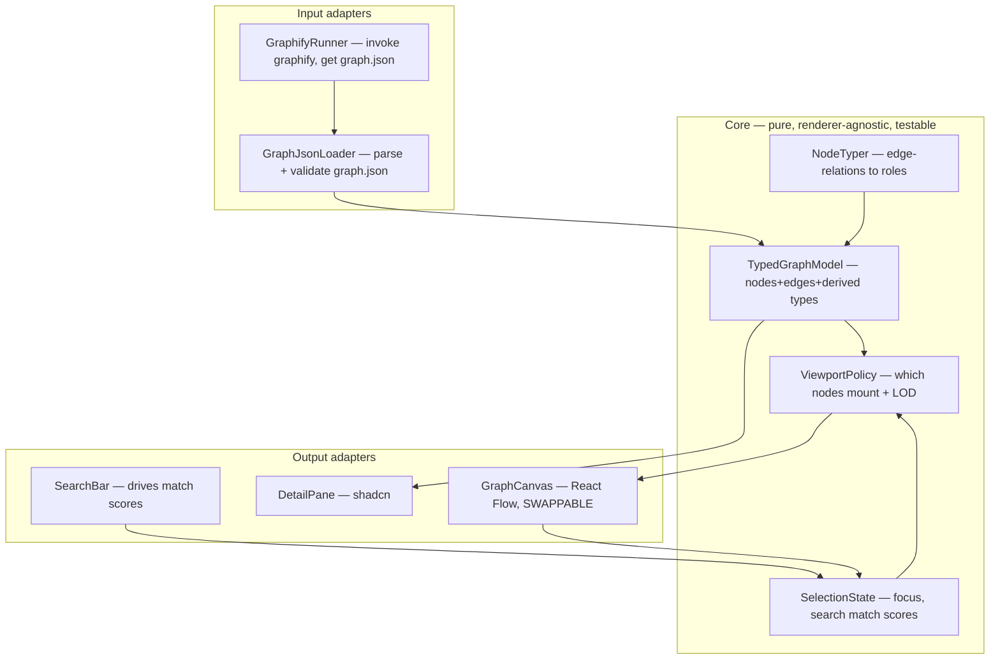

# Codebase Atlas — Architecture (MVP: P0+P1)

**Pattern:** Hexagonal modular monolith. The **typed graph model** is the core (pure,
renderer-agnostic, testable). **graphify** (input) and **React Flow** (output) are adapters
at the edges. This structure IS the ADR-001 reversal hedge — the renderer is swappable
because the core never depends on it.

## Component decomposition



**Load-bearing boundary:** `Core` imports nothing from React Flow. `GraphCanvas` is the sole
React Flow touchpoint. Swapping it to WebGL leaves Core untouched — keeps ADR-001 reversal
cost Medium.

## Data model (core types — P0 adapter output)

```typescript
type NodeRole = 'entry-point' | 'module' | 'interface' | 'method' | 'leaf';

interface AtlasNode {
  id: string; label: string;
  sourceFile: string; sourceLocation: string | null;
  community: number;            // from graphify
  role: NodeRole;               // DERIVED deterministically (NodeTyper)
  fanIn: number; fanOut: number;
}
interface AtlasEdge {
  source: string; target: string;
  relation: 'imports_from'|'contains'|'method'|'uses'|'inherits'|'calls';
}
interface TypedGraphModel { nodes: AtlasNode[]; edges: AtlasEdge[]; }

interface ViewState {
  focusId: string | null;
  matchScores: Map<string, number>;  // 0..1 → GRADIENT opacity (US-003, not binary)
  mountedIds: Set<string>;           // ViewportPolicy output — SCALE-001 invariant
}
```

Design decisions embedded:
- `matchScores` 0..1 gradient (US-003 non-binary).
- `ViewState` separate from `TypedGraphModel` → search/focus update view, never remount (ADR-001).
- `mountedIds` from `ViewportPolicy` → the "never mount full set" invariant is ONE testable function.

## Node typing (deterministic, NodeTyper)

| Role | Signal from edges |
|---|---|
| interface | high `inherits`-in |
| module | has `contains` children |
| entry-point | high `calls`-in, low `calls`-out |
| method | target of `method` edge |
| leaf | zero dependents |

No LLM. Pure pass over edge relations. Codebase-agnostic (MAINT-001, US-006).

## Critical flows

**A — generate → render (US-001/007):** Maintainer → GraphifyRunner runs graphify (AST,
token-free) → graph.json → GraphJsonLoader → NodeTyper derives roles → TypedGraphModel →
ViewportPolicy caps mount set → GraphCanvas renders only mounted. Failure: graphify missing
→ error message, no crash (AVAIL-001).

**B — search → gradient (US-003, SCALE-001-critical):** SearchBar → SelectionState computes
matchScores (0..1) → GraphCanvas updates node STYLE props only. NO remount. Matches brighten,
non-matches fade toward background, none removed.

**C — click → pane (US-004):** GraphCanvas click → SelectionState.setFocus → DetailPane gets
node+neighbors from model; ViewportPolicy recomputes mount set around focus (LOD beyond).

## C4

- **L1 Context:** Developer/Maintainer → Codebase Atlas → depends on graphify → reads target repo.
- **L2 Container:** single local React app + graphify (external tool) + graph.json (file
  interface). No backend, no DB — local static app reading a JSON file.

## Decisions surfaced (ADRs)

- **ADR-001** (Accepted): React Flow, culling-first, adapter-decoupled. See `docs/adr/`.
- **ADR-002** (candidate): No backend — local static app reads graph.json directly. Reversal
  low; rationale: no multi-user / server-side compute in MVP.

## Flagged — NOT decided here

- **USABILITY-001 visual quality bar** ("clean UI"): deferred to `ui-ux-pro-max` (shadcn
  integration + component/design-token patterns) or sdlc `ui-design`. MUST run before/during
  P1 UI build. Tracked in `docs/requirements/RTM.md` open items. DO NOT FORGET.

## Excluded from MVP

Focus+context beyond basic mount-capping, blast-radius, reasons/tradeoff pane, C4/sequence
representation-switch, onboarding tour, agent-injection. All P2+ (see `docs/SPEC.md`).
